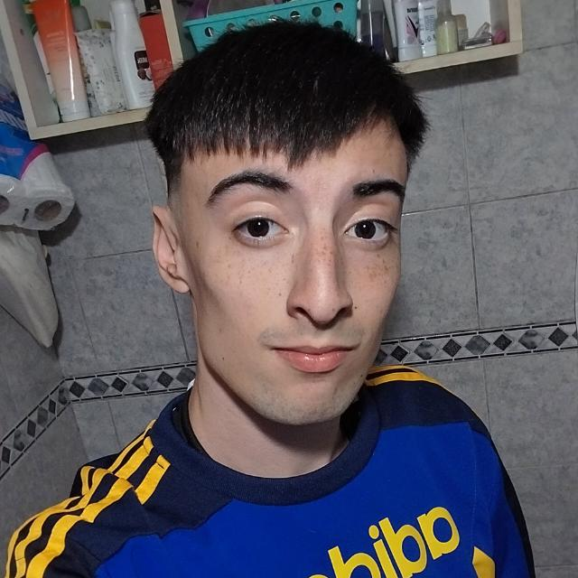

### NICOLAS VALENTIN NARDOIA
Hola soy Nicolas Nardoia, soy un estudiante de la tecnicatura de Programación de Videojuegos. Es mi segundo año en la carrera por lo que ya llevo 7 materias aprobadas por suerte.

Actualmente vivo en Villa Bosch, partido de Tres de Febrero. Vivo con mis padres, mis dos perritas Mora y Luci, y mi loro Walter.

Anteriormente en 2024 habia estado cursando en la UNTREF en la ingenieria en computación pero tuve una mala experiencia con la cursada y la deje. Al año siguiente en 2025 por un amigo que estaba haciendo la tecnicatura en programación decidi inscribirme en Videojuegos.

Los videojuegos es un hobby que se volvio un estilo de vida para mi ya que es un gran pasatiempo para divertirse con amigos o conocer gente, tanto fue el punto que logro interesarme mas del lado de un desarrollador, espero algun día poder crear algun juego argentino.

Hasta el día de hoy me esta gustando mucho la carrera, algunas materias llevan tiempo de estudio y practica pero se vuelve divertido cuando logras crear cosas lindas como en mi caso los parciales en los que tuve que crear un videojuego junto a mis compañeros de grupo para aprobar.

La UNAHUR me encanto como universidad tanto como el lado de la integración que te dan en el curso de ingreso, como por el lado de la enseñanza. Conoci mucha gente copada a lo largo de la cursada que me ayudaron demasiado, y también nos divertimos. 

### DATOS PERSONALES EXTRAS
- Estoy estudiando inglés por mi cuenta en el instituto GOENGLISH, en el que voy por el nivel intermedio.
- Soy hincha fanatico de Boca Juniors.
- Sueño con algun día ser parte de la creación de algun juego como Half-Life que es mi juego favorito.
- Conocer la empresa Valve por dentro y ver como se manejan en la creacion de videojuegos.
- Me gustaria viajar para conocer otros países de Europa, Sudamerica y obviamente el interior de Argentina.

